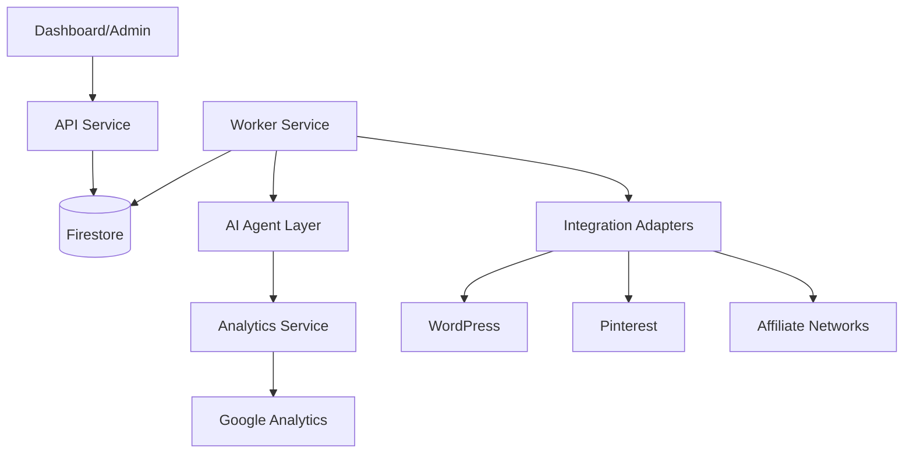
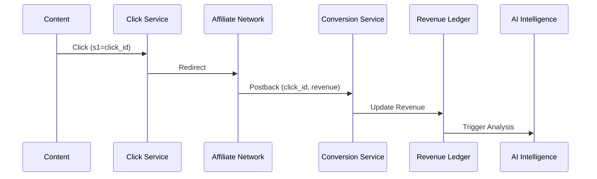

# Phase 2: Product Definition - Optilink OS

This document outlines the system architecture and product requirements for Optilink OS, an autonomous affiliate media operating system.

## 1. Product Requirements Document (PRD)

**Objective:** Build an autonomous loop that discovers affiliate opportunities, creates and publishes content, drives traffic, converts clicks, and optimizes performance via AI.

**Core Personas:**
- **Founder/Admin**: Oversees system performance, manages API credentials, monitors revenue loops.
- **Analyst (Future)**: Views metrics, monitors traffic trends, audits AI decisions.
- **Creator (Future)**: Manages content workflows, oversees AI-assisted editing.

**Non-Functional Requirements:**
- **Affiliate Agnostic**: Must support new networks via plug-and-play adapters.
- **Scalability**: Distributed microservices architecture for handling heavy AI/worker loads.
- **Security**: Least-privilege access, audit logging, secure secret management.
- **Reliability**: Self-healing worker queues, DLQs for failed jobs.

**Success Metric:** Revenue Generated Per Autonomous Loop.

---

## 2. System Architecture Diagram (Mermaid)



---

## 3. Database Schema (Expanded)

- **`users`**: {id, role, email, profile}
- **`jobs`**: {id, type, status, payload, retries, created_at}
- **`content`**: {id, status, wp_id, metadata, performance_stats}
- **`clicks`**: {id, offer_id, timestamp, source, click_id, s1}
- **`conversions`**: {id, click_id, revenue, timestamp, status}
- **`offers`**: {id, network_id, status, epc, performance}
- **`metrics`**: {id, date, type, value, dimension}
- **`event_logs`**: {id, event_type, payload, timestamp}
- **`audit_logs`**: {id, user_id, action, timestamp, metadata}
- **`ai_reports`**: {id, report_type, content, timestamp}
- **`ai_decisions`**: {id, trigger, condition, action, outcome}
- **`automation_runs`**: {id, workflow_id, status, logs}
- **`system_health`**: {id, component, status, last_check}
- **`queue_metrics`**: {id, queue, success_rate, throughput}

---

## 4. Revenue Attribution Architecture

### Sequence Diagram


---

## 5. AI Decision Engine & CEO Brain

| Trigger | Condition | Agent | Action | Expected Outcome |
| :--- | :--- | :--- | :--- | :--- |
| Revenue > Thres | Rev > $500 | Strategist | Generate Cluster | Increased Reach |
| CTR < Thres | CTR < 1% | Optimizer | Rewrite Title | Improved CTR |
| EPC drops | EPC < 0.5 | Optimizer | Rotate Offer | Higher EPC |

**AI Executive (CEO) Brain:**
- **Inputs:** Revenue, Traffic, Offers, SEO, Creators.
- **Outputs:** Action items, Strategy reports, Forecasts.

---

## 6. Autonomous Loop (State Machine)

1. **Research** -> 2. **Content Generation** -> 3. **SEO Optimization** -> 4. **Publishing** -> 5. **Distribution** -> 6. **Tracking** -> 7. **Revenue Analysis** -> 8. **Optimization** -> Repeat.

---

## 7. Event & Agent Protocol

**Agent Message Schema:**
```json
{
  "task_id": "string",
  "agent": "string",
  "event": "string",
  "payload": "object",
  "priority": "number",
  "status": "string"
}
```

**Event Catalog:**
- `keyword_discovered`, `content_generated`, `content_published`, `traffic_spike`, `ctr_drop`, `epc_drop`, `conversion_received`, `offer_winner_detected`, `revenue_goal_hit`.

---

## 8. Scalability & Metrics

**Roadmap:**
1. Render + Firestore
2. Redis + BullMQ
3. Postgres + BigQuery
4. AWS SQS + Lambda

**KPIs:** Queue Success Rate, Job Completion Rate, Revenue, EPC, CTR.

---

**Approval Required:** Phase 2 artifacts have been updated with conditional requirements. Ready for Phase 3.

